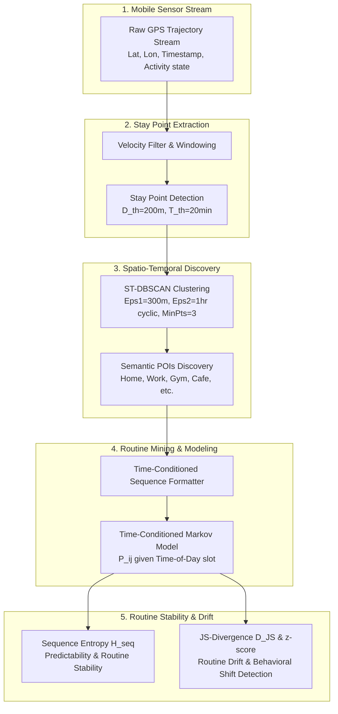

# HabitMiner 🧠📍

**A Context-Aware Framework for Personalized Routine Discovery Using Mobile Sensor Data**

[](LICENSE)
[](https://www.python.org/)
[](https://kotlinlang.org/)
[](https://developer.android.com/)

---

## 1. Executive Summary

Pervasive computing aims to build intelligent environments and services capable of sensing, understanding, and anticipating user context without explicit user manual input. Modern smartphones generate continuous, high-volume spatio-temporal streams via GPS and motion sensors. However, extracting high-level semantic routines (e.g., "Commuting to Work", "Gym Session", "Home Evening Routine") from raw, noisy GPS trajectories remains a non-trivial challenge.

**HabitMiner** addresses this gap by introducing a lightweight, privacy-preserving, context-aware framework. By combining **Stay Point Extraction**, **Spatio-Temporal Clustering (ST-DBSCAN)**, **Time-Conditioned Markov Sequence Mining**, and **Information Theory Metrics (Sequence Entropy & Bounded JS-Divergence)**, HabitMiner learns daily patterns, measures routine stability, and detects behavioral drift—all executed via edge-based computing on the user's mobile device.

---

## 2. System Architecture & Pipeline

HabitMiner converts raw GPS sensor streams into actionable routine insights through a multi-stage context extraction pipeline:



---

## 3. Project Objectives

* 📍 **Extract Meaningful Stay Points**: Filter high-frequency raw GPS trajectories into discrete stationary episodes defined by spatial radius $D_{th} = 200\text{ m}$ and duration $T_{th} = 20\text{ min}$.
* 🏙️ **Semantic Place Discovery**: Cluster stay points using **ST-DBSCAN** ($\epsilon_1 = 300\text{ m}$) to automatically uncover meaningful Points of Interest (POIs) such as home, workspace, or recreational spots.
* 🔄 **Sequential Pattern Mining**: Mine recurring daily/weekly movement sequences and model location transition probabilities using **Time-Conditioned Markov Chains**.
* 📊 **Routine Stability & Drift Measurement**: Apply **Sequence Entropy** to quantify daily routine predictability and **Jensen-Shannon (JS) Divergence** with rolling $z$-scores to detect behavioral modifications over time.
* 📱 **Privacy-Preserving Edge Architecture**: Maintain complete user data sovereignty by running on-device processing via an Android prototype powered by Kotlin, Room DB (with SQLCipher), and Activity Recognition API triggers.

---

## 4. Implementation Roadmap

```
HabitMiner Development Roadmap
│
├── 🔹 Phase 1: Offline Intelligence Engine (Python)
│   ├── GeoLife GPS Trajectory Parser & Velocity Filter
│   ├── Stay Point Extractor & ST-DBSCAN Implementation
│   ├── Time-Conditioned Markov Chain Predictor
│   └── Sequence Entropy & JS-Divergence Analytical Engine
│
├── 🔹 Phase 2: On-Device Android Prototype (Kotlin)
│   ├── Activity Recognition & Context-Aware Location Collector
│   ├── Room Database Schema for Stay Points & Trajectories
│   ├── Cold-Start Mitigation & Trajectory Replay Engine
│   └── Background Processing via WorkManager
│
└── 🔹 Phase 3: Evaluation & Visualization Dashboard
    ├── Interactive Map Visualization (Folium / Kepler.gl)
    ├── Routine Stability & Drift Analytics
    └── Next-Location Accuracy (Top-1/Top-3, MRR) Benchmarking
```

---

## 5. Technology Stack

| Domain | Technologies / Libraries |
| :--- | :--- |
| **Offline Engine (Python)** | Python 3.10+, GeoPandas, Shapely, Scikit-learn, NumPy, Pandas, Folium, Matplotlib |
| **Mobile Prototype (Android)** | Kotlin, Android SDK, Room Database (SQLCipher), WorkManager, Activity Recognition API |
| **Algorithms** | Stay Point Detection, ST-DBSCAN, Time-Conditioned Markov Chains, Sequence Entropy, JS-Divergence |
| **Validation Dataset** | Microsoft GeoLife GPS Trajectory Dataset (17,855 trajectories, 1.2M+ km) |

---

## 6. Repository Layout

```
Pervasive Computing/
├── README.md               # Main Project Overview & Setup Guide
├── .gitignore              # Version Control Ignore Rules
├── docs/                   # Detailed Architecture, Methodology & Dataset Specs
│   ├── ARCHITECTURE.md     # System design & component interaction specifications
│   ├── METHODOLOGY.md     # Mathematical formulation of algorithms & evaluation metrics
│   └── DATASET.md         # GeoLife dataset ingestion & parsing guide
├── engine/                 # Phase 1: Python Offline Intelligence Engine
│   └── README.md           # Engine setup & execution guide
├── android/                # Phase 2: Android Kotlin Prototype
│   └── README.md           # Mobile app build & replay instructions
└── data/                   # Dataset Directory (gitignored raw files)
    └── README.md           # Dataset folder structure guidelines
```

---

## 7. Documentation Index

For technical details, mathematical formulas, and data preparation guides, refer to the documentation:

- 📐 [**Methodology Specification**](docs/METHODOLOGY.md) - Mathematical definition of Stay Points, ST-DBSCAN, Markov Chains, Entropy, and JS Divergence.
- 🏗️ [**Architecture Document**](docs/ARCHITECTURE.md) - Deep dive into system layers, Android clean architecture, Room DB schema, and cold-start strategies.
- 💾 [**Dataset Ingestion Guide**](docs/DATASET.md) - Details on acquiring and parsing the Microsoft GeoLife trajectory dataset.

---

## 8. Scope & Feasibility Boundaries

To keep HabitMiner lightweight, explainable, and resource-efficient for pervasive edge execution:
- ❌ **No Heavy Deep Learning**: Avoid compute-heavy LSTM/Transformer models that degrade mobile battery life.
- ❌ **No Continuous Cloud Streaming**: All processing occurs locally to preserve user privacy.
- ❌ **No Unconstrained GPS Polling**: Dynamic sensing triggered by Activity Recognition transitions.

---

## 9. License & Citation

Distributed under the **MIT License**. See `LICENSE` for more information.
