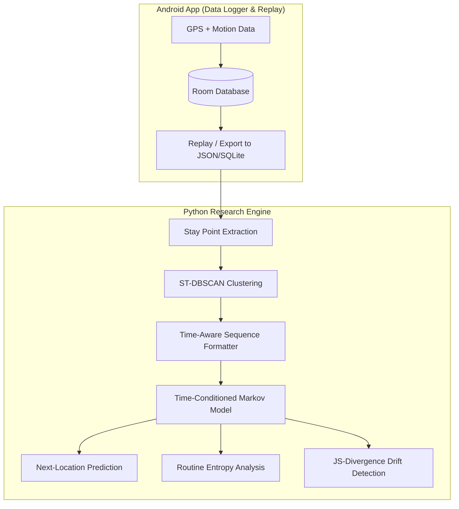

# HabitMiner 🧠📍

**A Context-Aware Framework for Personalized Routine Discovery Using Mobile Sensor Data**

[](LICENSE)
[](https://www.python.org/)
[](https://kotlinlang.org/)
[](https://developer.android.com/)

---

## 1. Executive Summary

Pervasive computing aims to build intelligent environments and services capable of sensing, understanding, and anticipating user context. Modern smartphones generate continuous, high-volume spatio-temporal streams via GPS and motion sensors. However, extracting high-level semantic routines (e.g., "Commuting to Work", "Gym Session", "Home Evening Routine") from raw, noisy GPS trajectories remains a non-trivial challenge.

**HabitMiner** addresses this gap by introducing a **Hybrid Architecture** framework. It separates robust mobile data collection (Android) from heavy analytical processing (Python). By combining custom-built **Stay Point Extraction**, **Time-Conditioned Markov Sequence Mining**, and **Information Theory Metrics (Sequence Entropy & Bounded JS-Divergence)** with established spatial clustering libraries (ST-DBSCAN), HabitMiner learns daily patterns, measures routine stability, and detects behavioral drift.

---

## 2. Hybrid System Architecture & Pipeline

HabitMiner utilizes a hybrid approach: an Android application acts as a context-aware data logger and replay engine, while a dedicated Python research engine performs the heavy algorithmic routine extraction.



---

## 3. Project Scope & Implementation Strategy

To maintain a manageable, research-oriented scope suitable for a semester timeframe, the project explicitly divides what is custom-built versus what leverages existing infrastructure.

### 🛠️ What is Implemented from Scratch (Core Research)
* GeoLife GPS trajectory parser and preprocessing filters.
* Stay-point extraction algorithm (distance and time thresholds).
* Time-conditioned Markov transition models.
* Next-location temporal prediction logic.
* Shannon entropy calculations for routine predictability.
* KL-Divergence / JS-Divergence routine drift detection.
* Formal evaluation metrics (Top-1/Top-3 Accuracy, MRR).

### 📦 What Uses Established Libraries (Infrastructure)
* **ST-DBSCAN / Mobility Clustering**: Leveraging existing data science libraries (e.g., `scikit-mobility`, `scikit-learn`) rather than reinventing standard clustering math.
* **Data Handling & Visualization**: Using `Pandas`, `NumPy`, and `Folium`.
* **Mobile Infrastructure**: Using Android native Location APIs, Activity Recognition, Room Database, and WorkManager.

### 🚫 What is Explicitly OUT of Scope
* **NO** Deep Learning / LSTMs / Transformers.
* **NO** Cloud Backends or complex Flask server setups.
* **NO** User authentication or social features.
* **NO** Large-scale real-user data collection (relying primarily on Microsoft GeoLife dataset).
* **NO** Fancy Android UI (focus is on background collection and data export).
* **NO** Real-time cloud analytics.

---

## 4. Implementation Status (Phase 1 Complete)

We have successfully completed a full **Vertical Slice** implementation of Phase 1, encompassing both the Python Research Engine and the core Android Data Logger:

### ✅ Python Intelligence Engine (`engine/`)
- **Data Ingestion**: `parser.py` safely loads and cleans GeoLife datasets.
- **Spatio-Temporal Abstraction**: 
  - `stay_point.py`: Haversine-based Stay Point Extraction.
  - `stdbscan.py`: Semantic POI Clustering using custom cyclic temporal distances.
- **Pattern Discovery**: `markov_model.py` implements a Time-Conditioned First-Order Markov chain.
- **Analytics & Visualization**: `routine_analytics.py` (Sequence Entropy & JS-Divergence) and `visualize.py` (Folium map generation) tied together via `main.py`.

### ✅ Android Data Logger (`android/`)
- **Local Persistence**: Integrated Room Database (`AppDatabase`, `RawGpsEntity`, `LocationDao`).
- **Background Tracking**: Developed `LocationTrackingService` via `FusedLocationProviderClient`.
- **Data Replay & Export**: Implemented `TrajectoryReplayManager` for offline testing and `ExportWorker` (WorkManager) for JSON extraction.
- **Basic UI**: Scaffolded a Jetpack Compose `MainActivity` shell.

---

## 5. Technology Stack

| Domain | Technologies / Libraries |
| :--- | :--- |
| **Research Engine (Python)** | Python 3.10+, GeoPandas, `scikit-mobility`, Scikit-learn, NumPy, Pandas, Folium |
| **Data Logger (Android)** | Kotlin, Android SDK, Room Database (SQLCipher), Activity Recognition API |
| **Validation Dataset** | Primary: Microsoft GeoLife GPS Trajectory Dataset (17,855 trajectories, 1.2M+ km) |

---

## 6. Repository Layout

```
Pervasive Computing/
├── README.md               # Main Project Overview & Scope Definition
├── .gitignore              # Version Control Ignore Rules
├── docs/                   # Detailed Architecture, Methodology & Dataset Specs
│   ├── ARCHITECTURE.md     # Hybrid system design & database schema
│   ├── METHODOLOGY.md     # Mathematical formulation of custom algorithms
│   └── DATASET.md         # GeoLife dataset ingestion & parsing guide
├── engine/                 # Phase 1: Python Offline Intelligence Engine
│   └── README.md           # Engine setup & execution guide
├── android/                # Phase 2: Android Data Logger & Replay Tool
│   └── README.md           # Mobile app build & export instructions
└── data/                   # Dataset Directory (gitignored raw files)
    └── README.md           # Dataset folder structure guidelines
```

---

## 7. License & Citation

Distributed under the **MIT License**. See `LICENSE` for more information.
