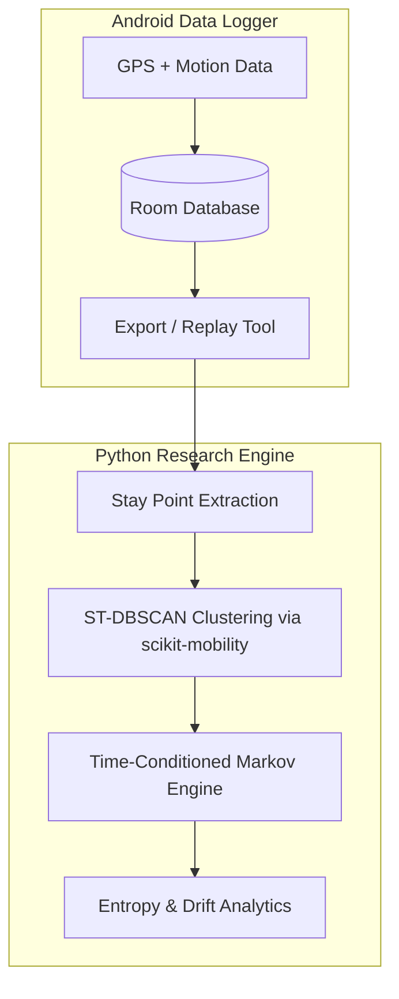
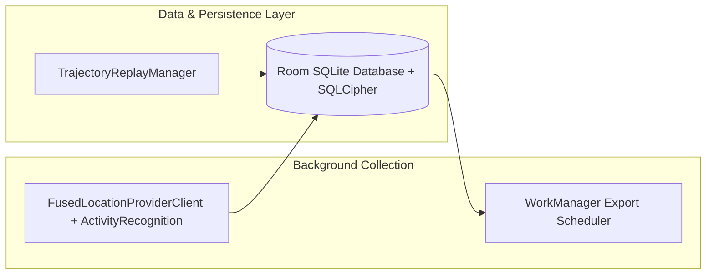
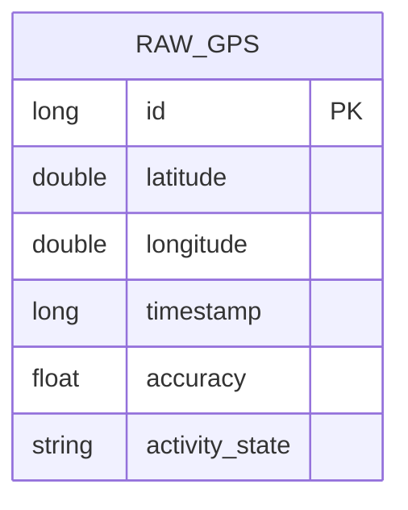

# HabitMiner: Architecture Specification 🏗️

This document outlines the Hybrid Architecture, data collection flow, database design, and research pipeline for **HabitMiner**.

---

## 1. Architectural Philosophy & Principles

HabitMiner is engineered around a **Hybrid Architecture** that strictly separates data collection from algorithmic research:

1. **Resource-Aware Android Collection**: The mobile device acts solely as a robust, battery-efficient data logger. It leverages **Android Activity Recognition API** (e.g. `STILL`, `WALKING`, `IN_VEHICLE`) to trigger location sampling, rather than aggressive timer-based GPS polling. 
2. **Dedicated Python Research Engine**: All algorithmic processing (clustering, Markov modeling, entropy analysis) is offloaded to a Python environment. This allows for rapid iteration and experimentation using standard data science libraries without fighting Android lifecycle constraints.
3. **Interpretability & Explainability**: The Python engine utilizes transparent probabilistic models (Time-Conditioned Markov Chains) and Information Theory metrics (Shannon Entropy, Bounded JS-Divergence) that provide clear, inspectable behavioral indicators.

---

## 2. Hybrid Data Pipeline

The architecture operates sequentially across the two environments:

---

## 3. Android Mobile Architecture (Phase 2 Prototype)

The Android prototype implements a clean, simplified architecture focused entirely on data persistence and export.

### Key Android Components

1. **Context-Aware Sensing Service**:
   - Leverages `ActivityRecognitionClient` to detect user motion state.
   - When motion state is `STILL`, location tracking pauses until `IN_MOTION` transition or geofence exit occurs, drastically reducing battery draw.
2. **Trajectory Replay Engine**:
   - Reads offline GeoLife `PLT` files or synthetic GPS tracks to emulate real-world sensor streams.
3. **Room Database Schema**:
   - Stores raw coordinates efficiently before bulk export.

---

## 4. Cold-Start Strategy & Mitigation

To handle new datasets or application installations before sufficient user routines are observed:

1. **Warmup Phase (Days 1–7)**: The system requires an initial collection period. Stay points and preliminary clusters are accumulated offline before the Python engine attempts any predictions.
2. **Time-of-Day Spatial Priors**: When sequence data is sparse, the Python predictor falls back to a time-of-day stationary prior ($P(s_j \mid \tau)$) rather than requiring full $s_i \to s_j$ transition history.

---

## 5. Security & Privacy Guardrails

- **Local Storage Encryption**: SQLite Room database encrypted using SQLCipher (`SupportFactory` initialized with KeyStore managed keys).
- **Offline Processing**: Data is exported manually via USB or local network JSON export. There is no cloud backend, preventing transmission of raw GPS coordinates to third-party servers.
