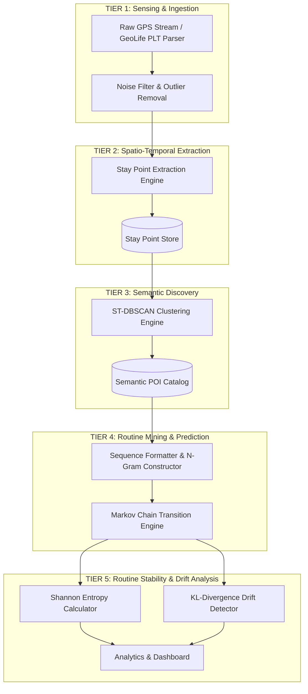
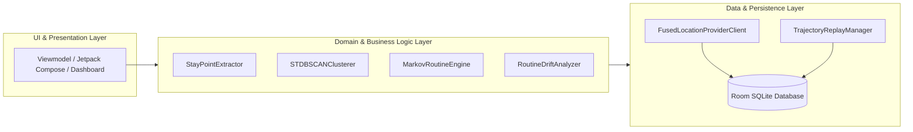
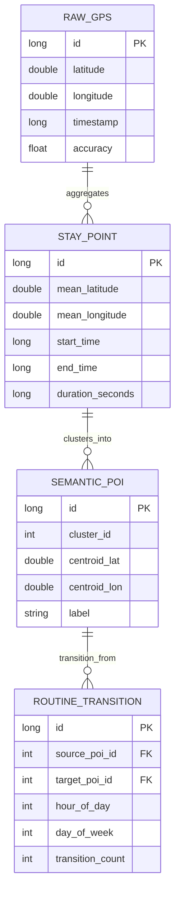

# HabitMiner: Architecture Specification 🏗️

This document outlines the software architecture, data processing tiers, edge-computing privacy guarantees, and database design for **HabitMiner**.

---

## 1. Architectural Philosophy & Principles

HabitMiner is engineered around three core principles:

1. **Privacy-Preserving Edge Intelligence**: Raw GPS coordinates contain sensitive private information (home address, personal habits, medical visits). HabitMiner performs spatio-temporal clustering and routine discovery locally on the client device without transmitting raw coordinates to external cloud infrastructure.
2. **Resource-Aware Pervasive Computing**: Continuous GPS polling drains smartphone battery rapidly. The system uses adaptive location sampling and batch stay point detection to balance context fidelity with energy conservation.
3. **Interpretability & Explainability**: Rather than relying on opaque deep neural networks, HabitMiner utilizes transparent probabilistic models (Markov Chains) and Information Theory metrics (Shannon Entropy, KL-Divergence) that provide clear, inspectable behavioral indicators.

---

## 2. Multi-Tier Context Extraction Pipeline

The architecture is divided into five logical tiers operating sequentially:

### Component Details

#### Tier 1: Sensing & Data Ingestion
- **GPS Stream Ingestion**: Captures raw tuple vectors $p_i = (\text{lat}_i, \text{lon}_i, t_i, \text{alt}_i)$.
- **Filtering Unit**: Removes satellite multipath noise and impossible movement vectors (speeds $> 150 \text{ km/h}$ for pedestrian/urban context).

#### Tier 2: Stay Point Extraction
- **Temporal-Spatial Windowing**: Evaluates consecutive GPS points to identify stationary periods where distance traveled remains within $D_{th}$ across duration $T_{th}$.
- **Stay Point Abstraction**: Collapses hundreds of raw GPS points into a single stay point $s = (\bar{\text{lat}}, \bar{\text{lon}}, t_{\text{start}}, t_{\text{end}}, \Delta t)$.

#### Tier 3: Semantic POI Discovery
- **ST-DBSCAN Engine**: Clusters stay points across spatial proximity $\epsilon_1$, temporal window overlap $\epsilon_2$, and density threshold $MinPts$.
- **Semantic Mapping**: Discovered spatial clusters are assigned persistent POI identifiers ($c_1, c_2, \dots, c_k$).

#### Tier 4: Routine Mining & Transition Modeling
- **Trajectory Tokenization**: Converts time-ordered POI visits into discrete sequence tokens (e.g., $c_1 \xrightarrow{8:00} c_2 \xrightarrow{17:30} c_1$).
- **Markov Chain Matrix**: Builds transition probability matrix $P(S_{t+1} = s_j \mid S_t = s_i)$ to estimate the user's next probable place.

#### Tier 5: Routine Stability & Drift Analytics
- **Shannon Entropy ($H_X$)**: Quantifies variability in daily location transitions. Low entropy signifies structured routine; high entropy signifies unpredictable mobility.
- **Kullback-Leibler Divergence ($D_{KL}$)**: Compares historical baseline transition distributions ($P$) against current weekly transition distributions ($Q$) to flag behavioral shifts.

---

## 3. Android Mobile Architecture (Phase 2 Prototype)

The Android prototype implements clean architecture principles using Kotlin, Jetpack components, and Room database.

### Key Android Components

1. **Adaptive Sensing Service**:
   - Uses `FusedLocationProviderClient` with dynamic polling rates.
   - Adjusts GPS sampling interval dynamically: 10s during active movement, 5 minutes when stationary.
2. **Trajectory Replay Engine**:
   - Reads offline GeoLife `PLT` files or simulated GPS tracks to emulate real-world sensor streams for repeatable testing and demonstrations.
3. **WorkManager Scheduler**:
   - Executes compute-intensive tasks (ST-DBSCAN clustering and Markov matrix updating) during idle device states or overnight charging windows.
4. **Room Database Schema**:

---

## 4. Phase 1 vs Phase 2 Data Interchange

To ensure seamless transitions between Python engine research (Phase 1) and Kotlin Android development (Phase 2), standardized JSON schema artifacts are used:

- `stay_points.json`: Exported stay points vector formatted with standardized timestamps (ISO-8601 UTC).
- `semantic_pois.json`: Centroid definitions, cluster radii, and discovered POI IDs.
- `transition_matrix.json`: Learned Markov state transition probabilities.

---

## 5. Security & Privacy Guardrails

- **Local Storage Encryption**: SQLite Room database encrypted using SQLCipher.
- **On-Device Execution**: No network socket transmission of raw GPS coordinates.
- **Zero Third-Party Analytics**: Analytics remain localized within the client device environment.
