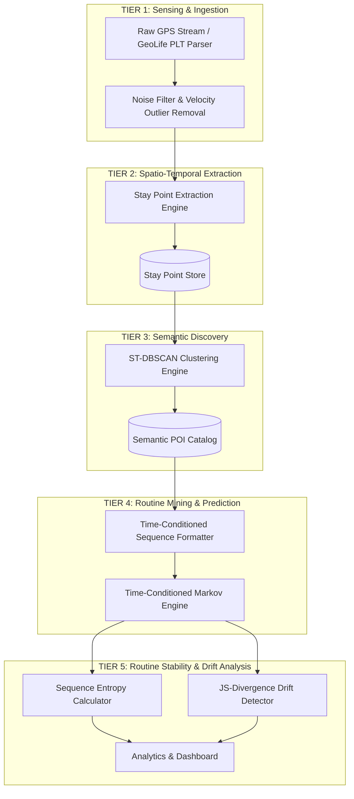
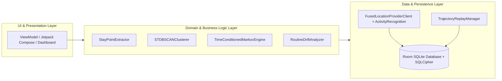
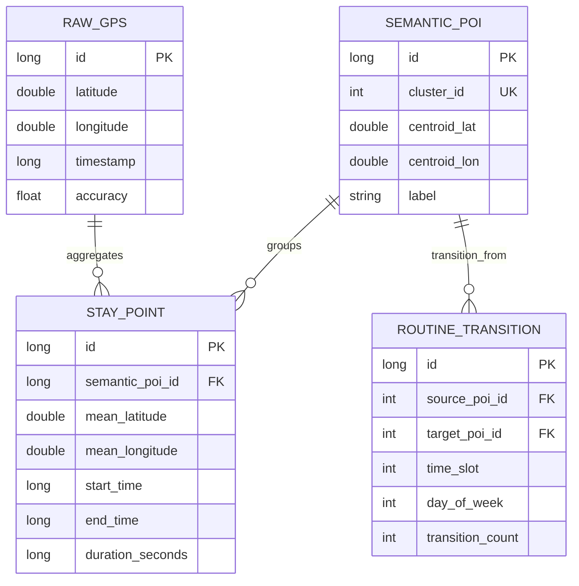

# HabitMiner: Architecture Specification 🏗️

This document outlines the software architecture, data processing tiers, edge-computing privacy guarantees, database design, and cold-start mitigations for **HabitMiner**.

---

## 1. Architectural Philosophy & Principles

HabitMiner is engineered around three core principles:

1. **Privacy-Preserving Edge Intelligence**: Raw GPS coordinates contain sensitive private information (home address, personal habits, medical visits). HabitMiner performs spatio-temporal clustering and routine discovery locally on the client device without transmitting raw coordinates to external cloud infrastructure.
2. **Resource-Aware Pervasive Computing**: Continuous GPS polling drains smartphone battery rapidly. The system leverages **Android Activity Recognition API** (e.g. `STILL`, `WALKING`, `IN_VEHICLE`) and geofencing transition triggers rather than aggressive timer-based GPS polling.
3. **Interpretability & Explainability**: Rather than relying on opaque deep neural networks, HabitMiner utilizes transparent probabilistic models (Time-Conditioned Markov Chains) and Information Theory metrics (Shannon Entropy, Bounded JS-Divergence) that provide clear, inspectable behavioral indicators.

---

## 2. Multi-Tier Context Extraction Pipeline

The architecture is divided into five logical tiers operating sequentially:

---

## 3. Android Mobile Architecture (Phase 2 Prototype)

The Android prototype implements clean architecture principles using Kotlin, Jetpack components, and Room database.

### Key Android Components

1. **Context-Aware Sensing Service**:
   - Leverages `ActivityRecognitionClient` to detect user motion state.
   - When motion state is `STILL`, location tracking pauses until `IN_MOTION` transition or geofence exit occurs, drastically reducing battery draw.
2. **Trajectory Replay Engine**:
   - Reads offline GeoLife `PLT` files or simulated GPS tracks to emulate real-world sensor streams for repeatable testing and demonstrations.
3. **WorkManager Scheduler**:
   - Executes compute-intensive tasks (ST-DBSCAN clustering and Markov matrix updating) during idle device states or overnight charging windows (`RequiresCharging = true`).
4. **Room Database Schema**:

---

## 4. Cold-Start Strategy & Mitigation

To handle new application installations before sufficient user routines are observed:

1. **Warmup Phase (Days 1–7)**: The system operates in passive sensing mode. Stay points and preliminary clusters are accumulated without exposing low-confidence predictions to the user interface.
2. **Time-of-Day Spatial Priors**: When sequence data is sparse, the predictor falls back to a time-of-day stationary prior ($P(s_j \mid \tau)$) rather than requiring full $s_i \to s_j$ transition history.
3. **Confidence Scoring Threshold**: Next-location predictions are only surfaced in the UI when the transition state probability exceeds confidence threshold $\theta_{\text{conf}} \ge 0.40$.

---

## 5. Phase 1 vs Phase 2 Data Interchange

To ensure seamless transitions between Python engine research (Phase 1) and Kotlin Android development (Phase 2), standardized JSON schema artifacts are used:

- `stay_points.json`: Exported stay points vector formatted with standardized timestamps (ISO-8601 UTC).
- `semantic_pois.json`: Centroid definitions, cluster radii, and discovered POI IDs.
- `transition_matrix.json`: Learned Markov state transition probabilities.

---

## 6. Security & Privacy Guardrails

- **Local Storage Encryption**: SQLite Room database encrypted using SQLCipher (`SupportFactory` initialized with KeyStore managed keys).
- **On-Device Execution**: No network socket transmission of raw GPS coordinates.
- **Zero Third-Party Analytics**: Analytics remain localized within the client device environment.
